<p align="center">
  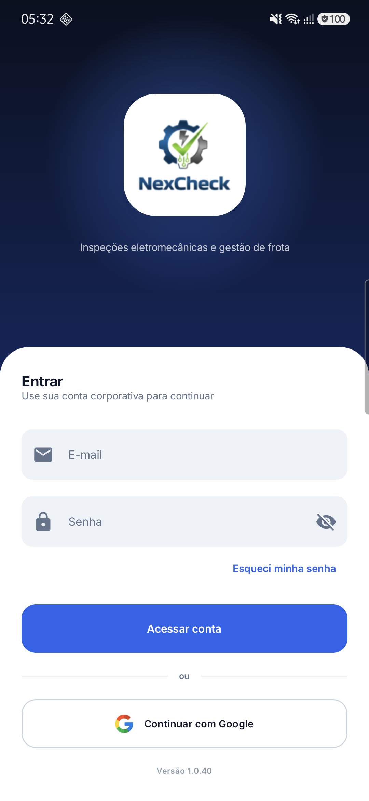
</p>

<h1 align="center">NexCheck</h1>

<p align="center">
  Inspeções eletromecânicas e gestão de frota de caminhões, direto do celular.
</p>

<p align="center">
  
  
  
  
  
</p>

---

## Download

Baixe o APK mais recente em **[Releases](https://github.com/hsrodrigues/NexCheck/releases/latest)**. Para receber as atualizações automaticamente, adicione este repositório no [Obtainium](https://github.com/ImranR98/Obtainium).

## Sobre

O **NexCheck** é um app Android para vistoriadores e equipes de frota. Com ele, a vistoria eletromecânica de cavalos mecânicos e carretas é feita no celular: checklist item a item, assinatura do motorista e do vistoriador, relatório pronto para imprimir e controle automático dos vencimentos.

Além das vistorias, o app reúne aferição de fumaça (escala Ringelmann), diário de bordo, agenda, registro de ocorrências e gestão de usuários com permissões por cargo.

## Funcionalidades

### Vistoria eletromecânica
- **Vistoria Cavalo e Vistoria Carreta**: checklist por seções (freios, direção, vazamentos, elétrica…) com BOM / RUIM / N/A, progresso em tempo real e o botão "Restantes: Bom" para agilizar.
- **Revistoria**: carrega automaticamente o último laudo da placa para corrigir só o que foi reprovado.
- **Status automático**: qualquer item RUIM deixa o veículo **Não liberado** e gera a lista de serviços necessários.
- **Assinaturas** do motorista e do vistoriador na própria tela.
- **Relatórios** com visual próprio, prontos para imprimir ou salvar em PDF.
- **Pendências**: vistorias vencidas, a vencer e revistorias, com aviso pelo WhatsApp.

### Operacional
- **Aferição de fumaça** pela escala Ringelmann, com controle de vencimento por placa.
- **Diário de bordo**: checklist pré-carregamento com composição (Padrão, Rodotrem…) e tipo de carroceria.

### Gestão
- **Agenda** de vistorias em calendário, com marcação de vencidas, a vencer e em dia.
- **Ocorrências**: acidentes, incidentes e falhas mecânicas, com sugestão automática da causa a partir do relato.
- **Usuários e permissões**: cargos (Administrador, Inspetor, Escritório, Torre de Controle) e acesso por módulo.

### Experiência
- Login com Google (Credential Manager) ou e-mail e senha, com redefinição de senha.
- Tema claro e escuro.
- Navegação pelo menu lateral e painel inicial com os números do dia.
- Funciona offline: o Firestore sincroniza quando a conexão volta.

## Telas

> Os dados pessoais (nomes, e-mails, placas e empresas) aparecem borrados nos prints.

| Início | Tema escuro | Menu |
|:---:|:---:|:---:|
| 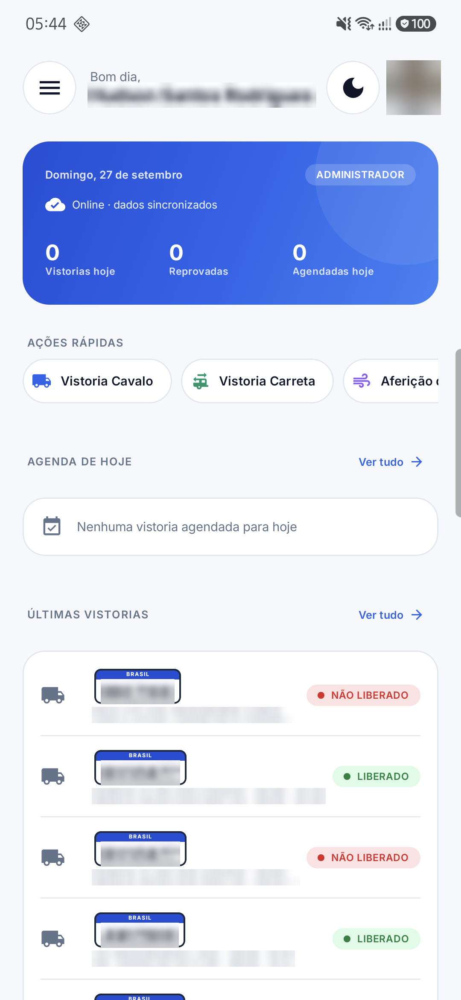 | 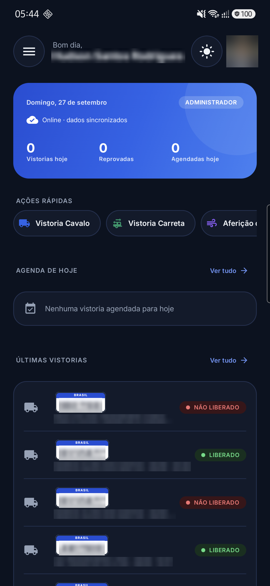 | 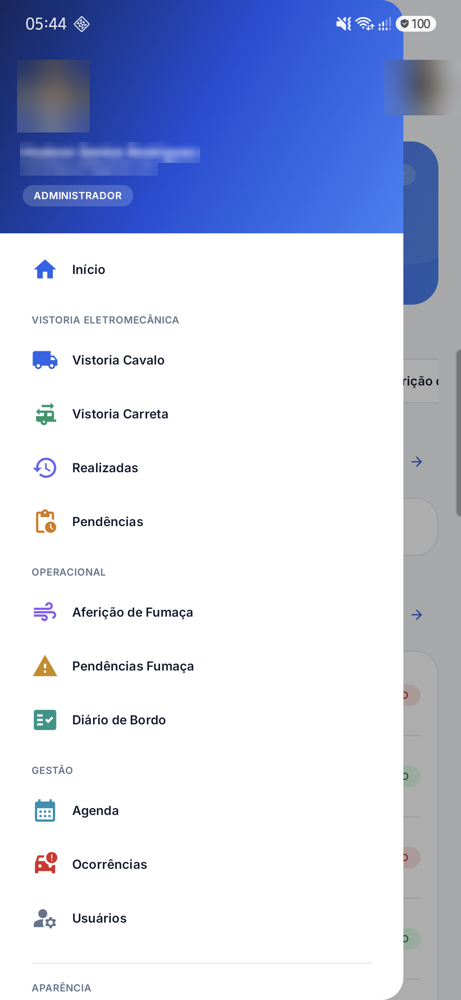 |

| Nova vistoria | Checklist | Relatório |
|:---:|:---:|:---:|
| 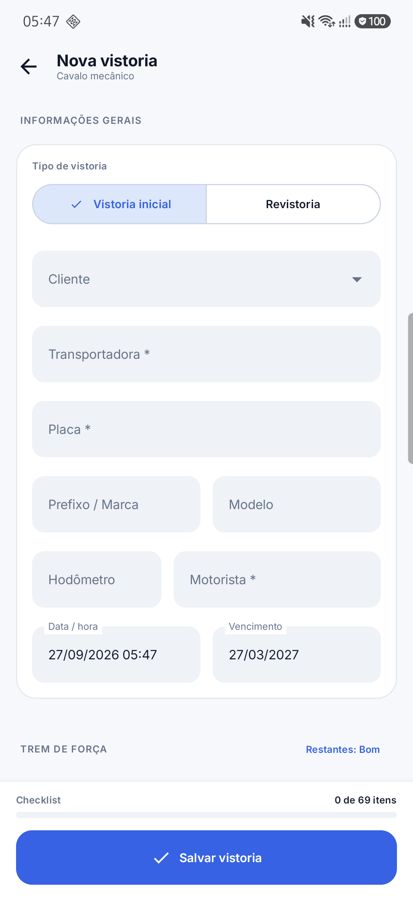 | 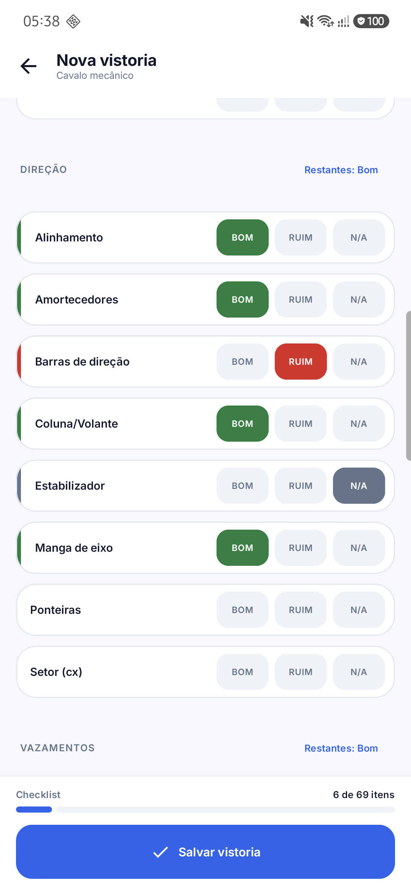 | 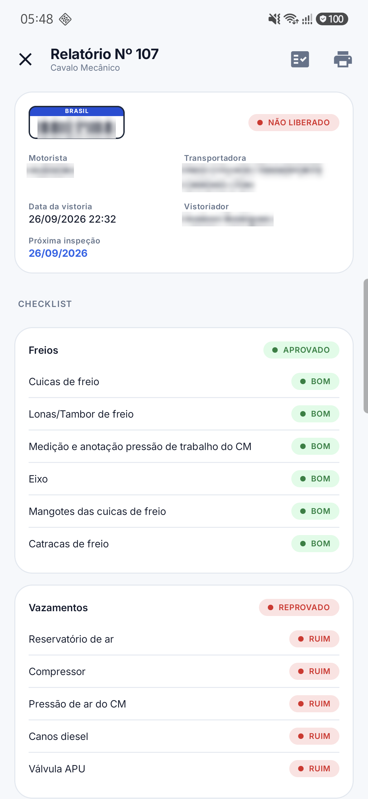 |

| Realizadas | Pendências | Agenda |
|:---:|:---:|:---:|
| 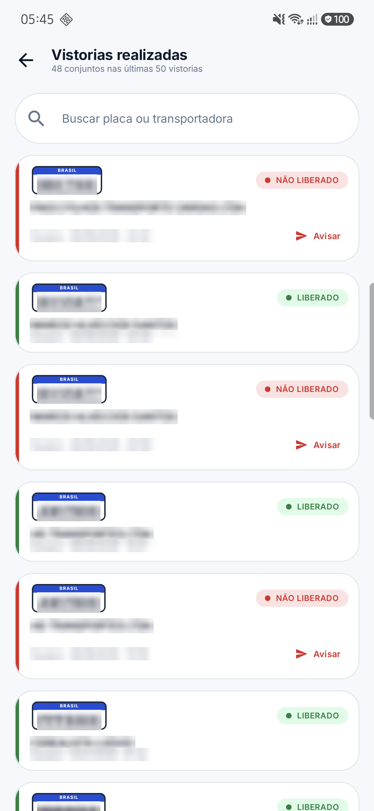 | 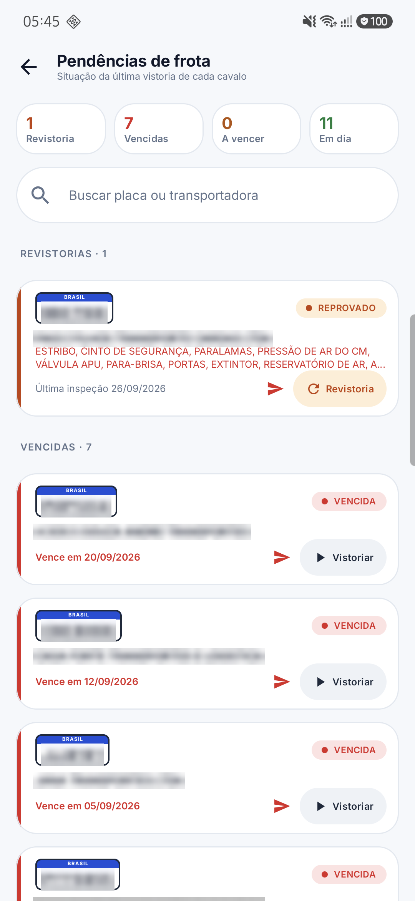 | 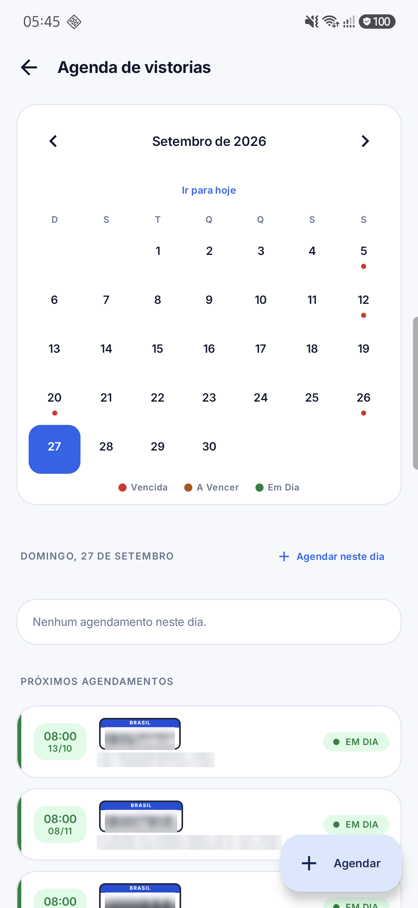 |

| Aferição de fumaça | Pendências de fumaça | Diário de bordo |
|:---:|:---:|:---:|
| 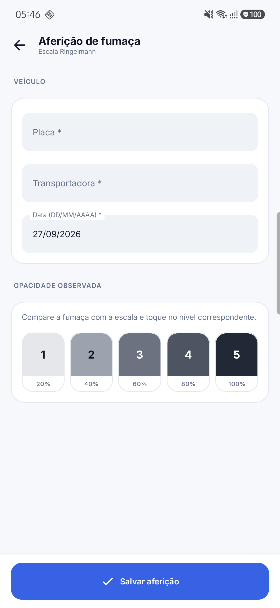 | 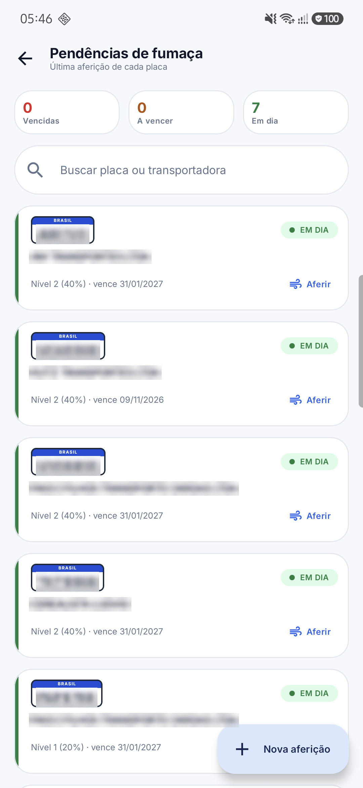 | 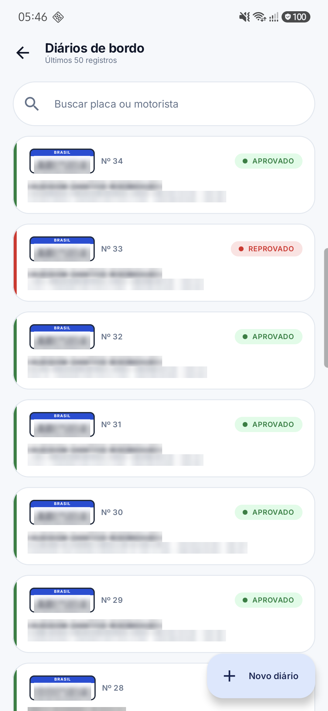 |

| Novo diário | Detalhe do diário | Ocorrências |
|:---:|:---:|:---:|
| 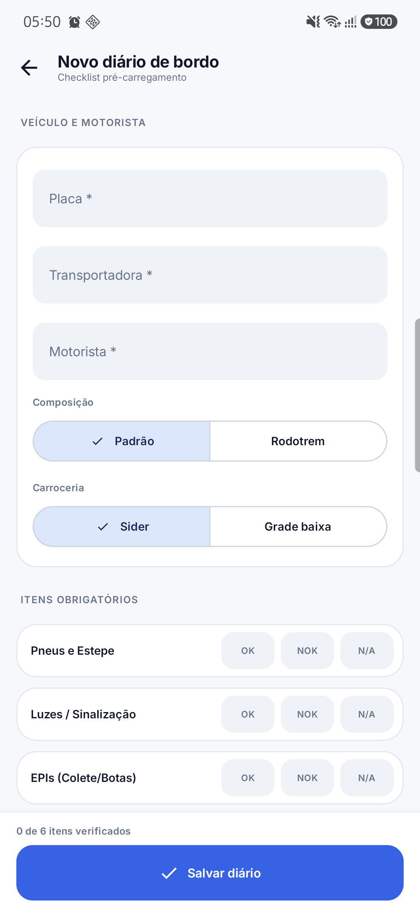 | 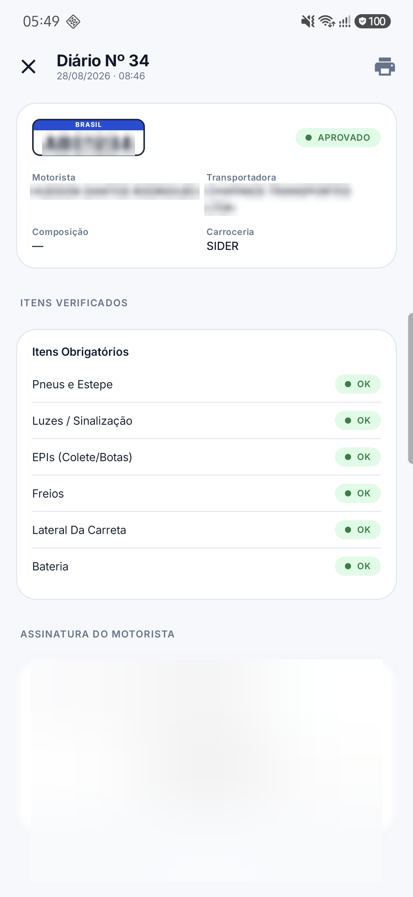 | 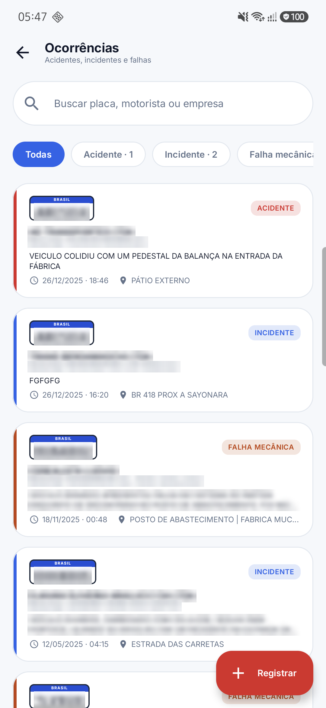 |

| Usuários |
|:---:|
| 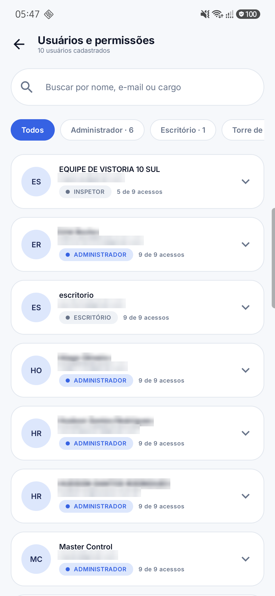 |

## Tecnologias

- **Kotlin** e **Jetpack Compose** (Material 3), com design system próprio (`ui/components`, `ui/theme`)
- **Navigation Compose**
- **Firebase Authentication** (Google e e-mail/senha) e **Cloud Firestore**
- **Credential Manager** + Google ID para o login com Google
- **Coil** para a foto do perfil
- Android 7.0 (API 24) ou superior

## Como compilar

Pré-requisitos: Android Studio recente (AGP 9.2) e JDK 17 ou superior (o JBR do Android Studio serve).

1. Clone o repositório:
   ```bash
   git clone https://github.com/hsrodrigues/NexCheck.git
   ```
2. Crie um projeto no [Firebase Console](https://console.firebase.google.com/) com o pacote `com.nexcheck.app`, ative **Authentication** (Google e E-mail/Senha) e **Firestore**.
3. Baixe o `google-services.json` e coloque em `app/google-services.json`. Esse arquivo não é versionado.
4. Em `LoginScreen.kt`, troque o `webClientId` pelo ID do cliente Web (OAuth) do seu projeto Firebase.
5. Compile e instale:
   ```bash
   ./gradlew :app:installDebug
   ```

O número do build (`app/version.properties`) sobe sozinho a cada compilação e forma a versão `1.0.<build>`.

## Estrutura

```
app/src/main/java/com/nexcheck/app/
├── MainActivity.kt           # navegação e sessão
├── AppModules.kt             # módulos, permissões e perfil do usuário
├── AppDrawer.kt              # menu lateral
├── LoginScreen.kt
├── MainMenuScreen.kt         # painel inicial
├── InspectionScreen.kt       # vistoria (cavalo / carreta)
├── InspectionRepository.kt   # acesso ao Firestore
├── ReportTemplates.kt        # relatórios para impressão
├── ...                       # pendências, fumaça, diário, agenda, ocorrências, usuários
└── ui/                       # tema e componentes do design system
```

## Licença

Copyright © 2026 Hudson Santos Rodrigues. **Todos os direitos reservados.**

O código está público apenas para consulta. Não é permitido copiar, modificar, distribuir ou usar este software, no todo ou em parte, sem autorização prévia por escrito do autor. Veja [LICENSE](LICENSE).
